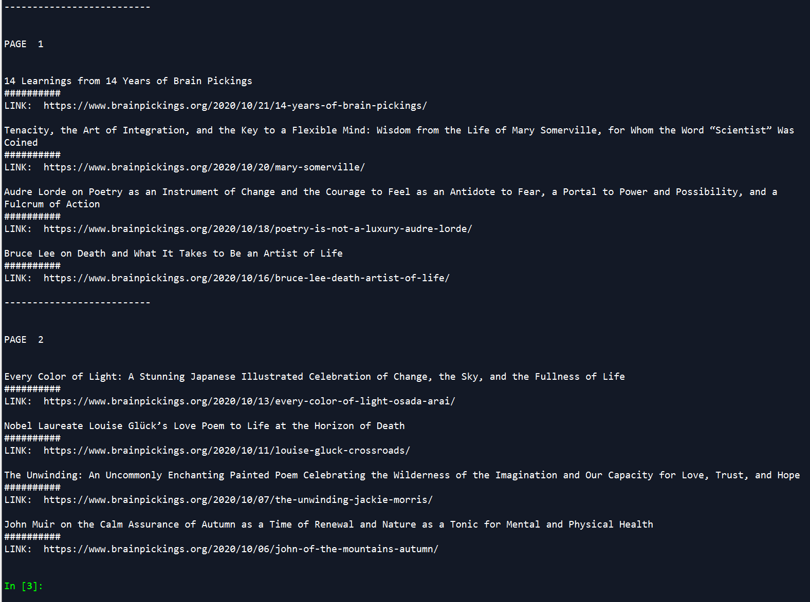

# brain_pickings_article_list
Generate a list of article titles per page from the blog Brain Pickings.

[Brain Pickings](https://www.brainpickings.org/) is one of my favorite blogs. Maria Popova (the author) has written a myriad of literary essays covering topics from science, all the way to children's books. Every post is informative and written with style. 

One missing feature in her website is the ability to quickly view all article titles without having to scroll through the content. For this reason I have written a small script that prints a list of article titles and their url for a certain number of pages.

## The Output
